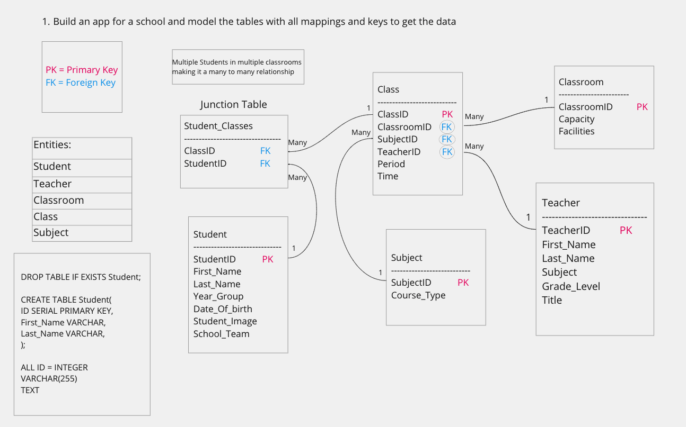

### Start here to see all city data

SELECT CITY
FROM STATION;

### Correct answer:

SELECT (count(CITY) - count(distinct CITY))
FROM STATION;

### How to get the 10th highest salary out of the table of salary list

### Build an app for a school and model the tables need with keys to get data

